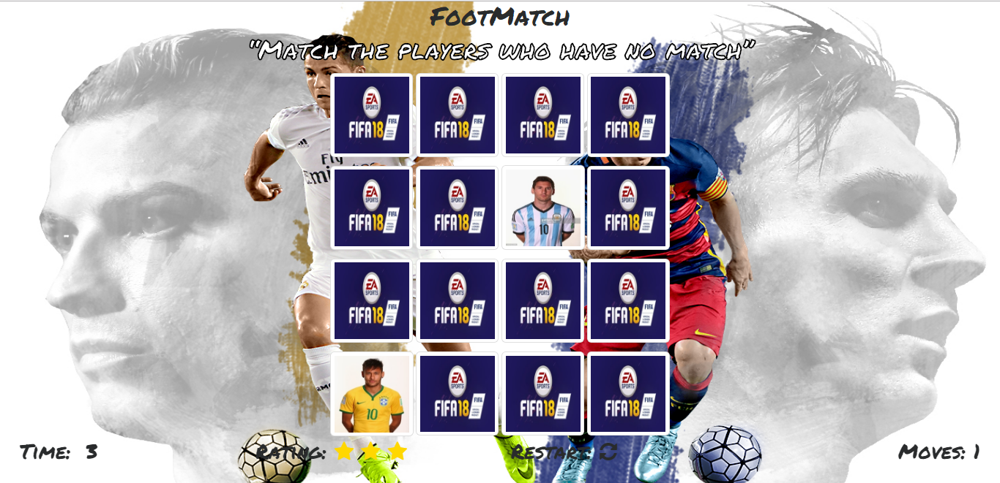
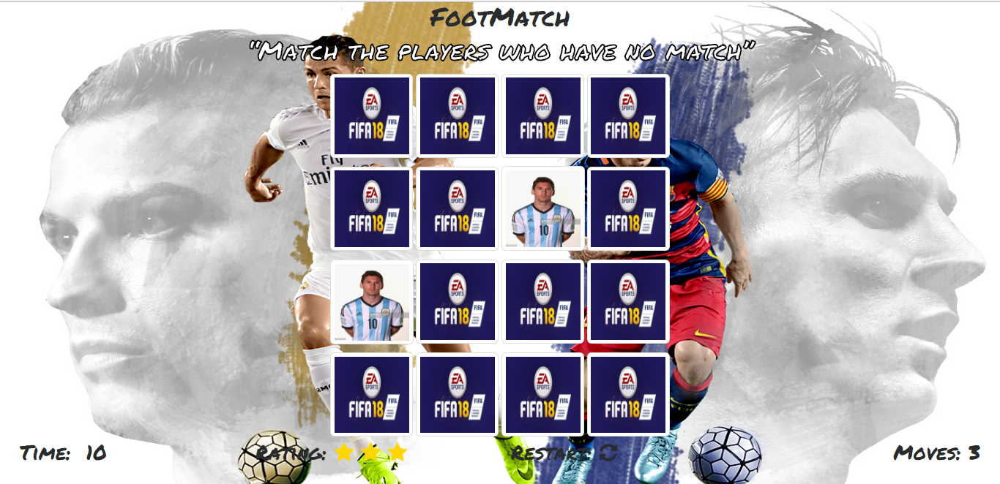

# Memory Game

Open and view the Project using the `.zip` file provided or at my [Github Repository](https://github.com/madhur-taneja/Memory-Game).

## Getting started

* The Memory Game Project is all about demonstrating my mastery of HTML, CSS, and JavaScript. I built a complete browser-based card matching game (also known as Concentration).

#### Tools required:
* [jQuery](https://code.jquery.com/jquery-3.2.1.min.js) (Javascript Library) for easier coding of javascript.
* [Bootstrap](https://maxcdn.bootstrapcdn.com/bootstrap/3.3.7/css/bootstrap.min.css) to make the page responsive.
* [Image Resizer](http://resizeimage.net/) to resize Cover and Card Images.
* [Color-Hex](http://www.color-hex.com/) to add hexa-decimal color codes in css.
* [HTML Beautifier](http://www.freeformatter.com/html-formatter.html) to Beautify HTML.
* [CSS Beautifier](http://www.freeformatter.com/css-beautifier.html) to Beautify CSS.
* [JS Beautifier](http://www.freeformatter.com/javascript-beautifier.html) to Beautify JS.
* [Online Markdown Editor](http://dillinger.io/) to test `README.md`.
* [Google Fonts](https://fonts.googleapis.com/css?family=Permanent+Marker) to add stylish text.
* [Fonts Awesome](http://fontawesome.io/) to add Icons.
* [Animate.css](https://daneden.github.io/animate.css/) to animate CSS.

#### References:
* [Stack Overflow](https://stackoverflow.com/) and [W3schools](https://www.w3schools.com/) for minor references.

##### Array shuffle:

- From [Stack Overflow](http://stackoverflow.com/questions/2450954/how-to-randomize-shuffle-a-javascript-array)

##### Card Flipping CSS:

- From [David Walsh's Page](https://davidwalsh.name/css-flip).

## Steps to run the Game:
> Open the project through the `.zip` file provided and extract file.
> To open `Index.html`:
* Open the main folder.
* Open `Index.html`.
* Click on start icon to play the game and get ratings for your performance.
> To open `engine.js`:
* Open `js` folder in `main` folder.
* Open `engine.js`.

## Steps to Play the Game

* The game board consists of 16 cards arranged randomly in a grid. The deck is made up of 8 pairs of cards, each with different players on one side.
Match the same players by flipping the cards in minimum amount of moves and time for a higher score and rating.
- The User flips one card over to reveal its underlying player.
- The User then turns over a second card, trying to find the corresponding card with the same player.
- If the cards match, both cards stay flipped over
- If the cards do not match, both cards are returned to their initial hidden state
- The game ends once all cards have been correctly matched.

## Screenshots

 
  
