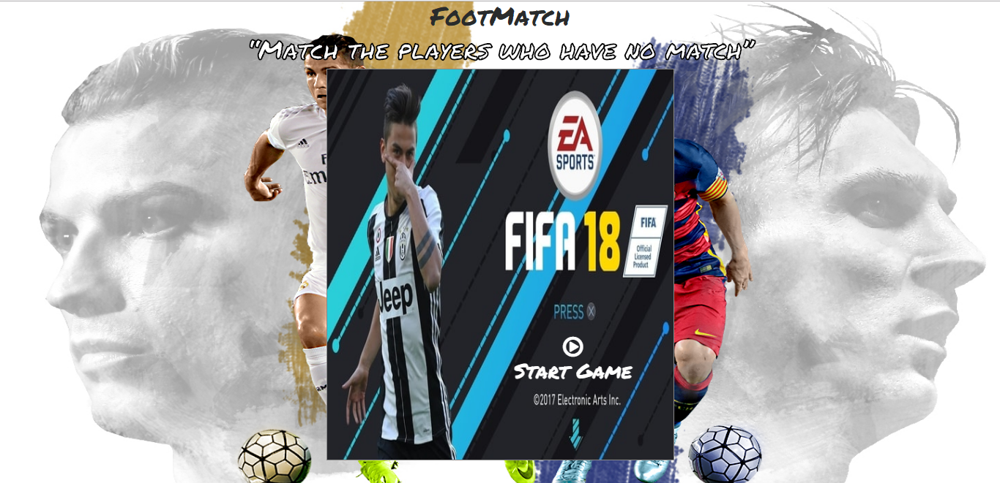

# Memory Game

The Memory Game consists of 16 cards arranged randomly in a grid. The deck is made up of 8 pairs of cards, each with different players on one side. Match the same players by flipping the cards in minimum amount of moves and time for a higher score and rating.

Open and view the Project using the `.zip` file provided or at my [Github Repository](https://github.com/madhur-taneja/Memory-Game).

The Game is also hosted on [Github](https://madhur-taneja.github.io/Memory-Game/).

## Table of Contents

- [Getting Started](#getting-started)
  - [Instructions](#instructions)
  - [Tools Required](#tools-required)
- [Running the App](#running-the-app)
- [Development](#development)
- [References](#references)

## Getting Started

This Project is all about demonstrating my mastery of HTML, CSS, and JavaScript. I built a complete browser-based card matching game (also known as Concentration).

This project was built from scratch and is a part of Udacity's Front-End Web Developer Nanodegree program. The project will be evaluated by a Udacity code reviewer according to the Landing Page project [rubric](https://review.udacity.com/#!/rubrics/591/view)

Udacity also provides the starter code for this project which can be found [here](https://github.com/udacity/fend-project-memory-game)

### Instructions

The game board consists of 16 cards arranged randomly in a grid. The deck is made up of 8 pairs of cards, each with different players on one side. The cards are arranged randomly on the grid with the players side down.

Match the same players by flipping the cards in minimum amount of moves and time for a higher score and rating.

Each turn:

- The User flips one card over to reveal its underlying player.
- The User then turns over a second card, trying to find the corresponding card with the same player.
- If the cards match, both cards stay flipped over
- If the cards do not match, both cards are returned to their initial hidden state

The game ends once all cards have been correctly matched.

### Tools Required

* [jQuery](https://code.jquery.com/jquery-3.2.1.min.js) (Javascript Library) for easier coding of javascript.
* [Bootstrap](https://maxcdn.bootstrapcdn.com/bootstrap/3.3.7/css/bootstrap.min.css) to make the page responsive.
* [Image Resizer](http://resizeimage.net/) to resize Cover and Card Images.
* [Color-Hex](http://www.color-hex.com/) to add hexa-decimal color codes in css.
* [HTML Beautifier](http://www.freeformatter.com/html-formatter.html) to Beautify HTML.
* [CSS Beautifier](http://www.freeformatter.com/css-beautifier.html) to Beautify CSS.
* [JS Beautifier](http://www.freeformatter.com/javascript-beautifier.html) to Beautify JS.
* [Online Markdown Editor](http://dillinger.io/) to test `README.md`.
* [Google Fonts](https://fonts.googleapis.com/css?family=Permanent+Marker) to add stylish text.
* [Fonts Awesome](http://fontawesome.io/) to add Icons.
* [Animate.css](https://daneden.github.io/animate.css/) to animate CSS.

## Running the App
* Open the project through the `.zip` file provided and extract file.
  > Open `index.html` from the root directory
* Click on start icon to play the game and get ratings(score and stars) for your performance.
* Restart the game with the reset button at the bottom of the screen or in the results modal after completing the game

## Development

* Create `index.html` with following markup:
  * Start and Win Modals
  * Game board with basic grid structure
  * Icons to handle functionalities

* Create `styles.css` with additional styling and media queries to make the app more responsive

* Create `engine.js` for adding the functionalities:
  * Add a Model called `players` with all the player info
  * Add a viewmodel with the following functions:
    * A function to trigger the game to start when clicking on Start Modal
    * `startGame` which Shows and Hides the Modal and calls `runGame` 
    * `runGame` which runs the game and contains the following functions: 
      > `createCards`  
        `shuffleArray`  
        `flipCard`  
        `matchCards`  
        `setRating`  
        `timer`  
    * `resetGame` to restart the game by resetting the game board
    * `endGame` to end the game and display the results in a modal
  
 For details now how these functionalities have been implemented, refer the source code.

## Screenshots

### Start Screen

### Game Board
 

### Gameplay 

#### 1. Unmatched Cards Open
 

#### 2. Unmatched Cards Closed
 

#### 3. Matched Cards Open

#### 4. Winning Screen

## References

* [Stack Overflow](https://stackoverflow.com/) and [W3schools](https://www.w3schools.com/) for minor references
* Array shuffle from Stack Overflow's [answer](http://stackoverflow.com/questions/2450954/how-to-randomize-shuffle-a-javascript-array)
* Card Flipping CSS from [David Walsh's Page](https://davidwalsh.name/css-flip)
